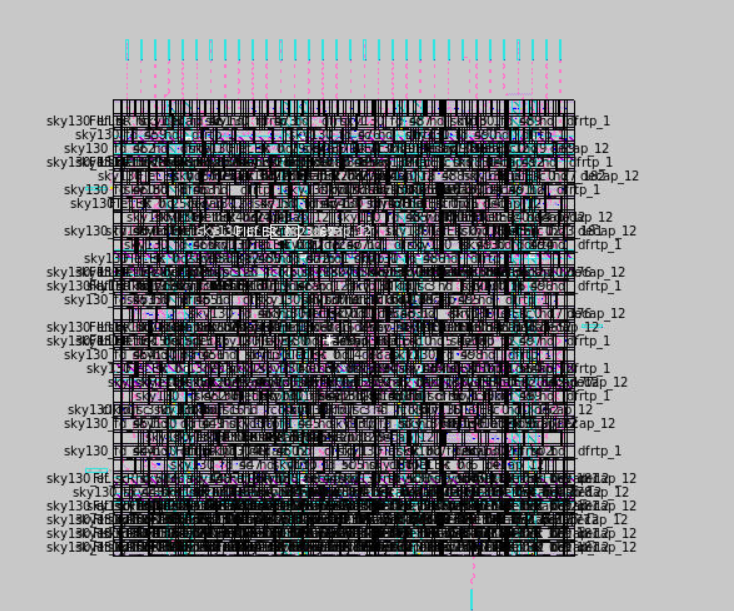
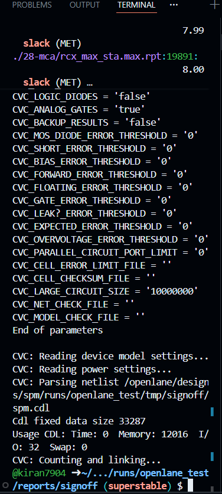

# 💾 Digital VLSI SoC Design and Planning – Final Project Report
| **Custom ALU layout (zoomed-out view)** | .png) |
|----------------------------------------|------------------------------------------------------------------------|

| **Magic console loading ALU + initial load** |  |
|----------------------------------------------|---------------------------------------------------------------------------------------|

| **Extraction log + simple_alu layout (side-by-side)** | .png) |
|--------------------------------------------------------|------------------------------------------------------------------------------------------------|

| **OpenLane run reports directory view** |  |
|----------------------------------------|--------------------------------------------------------------------------------|

| **Magic layout showing 144 initial DRC errors** |  |
|------------------------------------------------|----------------------------------------------------------|

| **Magic extraction log window** |  |
|--------------------------------|------------------------------------------------------------------|

| **Magic layout reload (zoomed)** |  |
|----------------------------------|----------------------------------------------------------------|

## ⚙️ Design Details
| Attribute | Value |
| :--- | :--- |
| **Design Name** | `spm` (small processing module) |
| **Author** | Kiran kumar siripurapu |
| **PDK** | Sky130A (Open-Source) |
| **Flow Used** | OpenLane (RTL → GDSII) |
| **Environment** | GitHub Codespaces |

---

## 📘 Project Overview

This project successfully implemented the **`spm`** (small processing module) design using the **OpenLane RTL-to-GDSII flow** on the **Sky130A open-source PDK**. The primary objective was to execute a full ASIC physical design flow and generate a signoff-clean **GDSII layout**.

The entire flow was completed inside GitHub Codespaces, resulting in a functionally and physically verified design.

### 🎯 Key Deliverables
* RTL (`spm.v`)
* Synthesis Reports (Area, Timing)
* Complete OpenLane Logs & Results
* Final GDSII & DEF Layout Files
* **Signoff:** DRC, STA, and CVC Verification

---

## 1. 🧩 RTL Design

The original RTL file was used without modification:

> `/home/vscode/Desktop/OpenLane/designs/spm/submission/RTL/spm.v`

---

## 2. 🚀 OpenLane Flow Summary

The complete RTL-to-GDSII flow was executed successfully, with all stages completing without fatal errors and passing final signoff checks.

| OpenLane Stage | Status | Details |
| :--- | :--- | :--- |
| **Synthesis** | ✔ Done | RTL transformed to gate-level netlist (Yosys) |
| **Floorplan** | ✔ Done | Core boundary, IO pins, and PDN generated |
| **Placement** | ✔ Done | No congestion issues reported |
| **Clock Tree Synthesis (CTS)** | ✔ Done | Balanced clock tree generated |
| **Routing** | ✔ Done | Global and detailed routing completed (TritonRoute) |
| **GDSII Generation** | ✔ Done | Final fabrication-ready layout |
| **DRC (Magic)** | **✔ 0 Errors** | Design Rule Check Passed |
| **STA (OpenSTA)** | **✔ Slack Met** | Setup & Hold Timing Passed |
| **CVC (Netlist Check)** | **✔ Passed** | Connectivity Verified |

> All OpenLane results, reports, and logs are located in: `submission/OpenLane/`

---

## 3. 📝 Synthesis & Physical Design

### 3.1. Synthesis (Yosys)
Synthesis generated the required netlist, area reports, and timing data.
* **Outputs Location:** `submission/Synthesis/`

### 3.2. Floorplan & Placement
The floorplan included automatic Power Distribution Network (PDN) generation, IO placement, tapcell, and decap insertion. Placement was successful with no reported congestion.

### 3.3. Clock Tree Synthesis (CTS)
A balanced clock tree was inserted to meet timing requirements.
* **Reports Location:** `submission/OpenLane/reports/placement/` and `submission/OpenLane/reports/cts/`

### 3.4. Routing
Routing was completed using FastRoute and TritonRoute, producing the final routed DEF and parasitic extraction files (SPEF).
* **Final Outputs Location:** `submission/OpenLane/results/final/`

---

## 4. 🖼️ Magic Layout Screenshots

| Description | Image |
| :--- | :--- |
| **Full Layout** |  |
| **Full Zoom** |  |
| **Standard Cell Zoom** |  |

---

## 5. ✅ Final Signoff Verification

The design passed all necessary signoff checks, confirming it is ready for tapeout.

### 5.1. 🧪 DRC (Design Rule Check)
Magic was used for the final DRC check on the GDSII layout.
* **Result:** **Total DRC errors = 0**
* **Reports Location:** `submission/OpenLane/reports/signoff/drc.rpt`
* **Screenshot:** 

### 5.2. ⏱️ STA (Static Timing Analysis)
OpenSTA verified the timing constraints on the post-route design.
* **Result:** Both **Setup** and **Hold** checks were **MET**.
* **Reports Location:** `submission/OpenLane/reports/signoff/`
* **Screenshot:** 

### 5.3. 🧬 CVC (Connectivity Verification Check)
CVC verified the consistency between the extracted layout netlist and the original synthesized netlist.
* **Result:** **CVC Passed successfully.**
* **Reports Location:** `submission/OpenLane/reports/signoff/spm.rpt`
* **Screenshot:** 

---

## 6. 🧾 Final GDSII & DEF

The final fabrication-ready layout files are included in the submission.

| File Type | Path |
| :--- | :--- |
| **GDSII File** | `submission/OpenLane/gds/spm.gds` |
| **DEF File** | `submission/OpenLane/def/spm.def` |

---

## 7. 🔗 Clickable Report & File Links

For quick access, all major reports and output files are linked below (relative to the repository root).

### 🔹 Core Layout Files
| File | Link |
| :--- | :--- |
| **Final GDSII** | [submission/OpenLane/gds/spm.gds](submission/OpenLane/gds/spm.gds) |
| **Final DEF** | [submission/OpenLane/def/spm.def](submission/OpenLane/def/spm.def) |
| **RTL Source** | [submission/RTL/spm.v](submission/RTL/spm.v) |

### 🔹 Signoff Reports (Post-Route)
| Report Type | File | Link |
| :--- | :--- | :--- |
| **DRC Report** | `drc.rpt` | [Link](submission/OpenLane/reports/signoff/drc.rpt) |
| **STA Summary** | `31-rcx_sta.summary.rpt` | [Link](submission/OpenLane/reports/signoff/31-rcx_sta.summary.rpt) |
| **STA Max (Setup)** | `31-rcx_sta.max.rpt` | [Link](submission/OpenLane/reports/signoff/31-rcx_sta.max.rpt) |
| **STA Min (Hold)** | `31-rcx_sta.min.rpt` | [Link](submission/OpenLane/reports/signoff/31-rcx_sta.min.rpt) |
| **CVC Report** | `spm.rpt` | [Link](submission/OpenLane/reports/signoff/spm.rpt) |
| **IR Drop (VPWR)** | `32-irdrop-VPWR.rpt` | [Link](submission/OpenLane/reports/signoff/32-irdrop-VPWR.rpt) |

### 🔹 Synthesis Reports
| Report Type | File | Link |
| :--- | :--- | :--- |
| **Area Report** | `1-synthesis.AREA_0.stat.rpt` | [Link](submission/Synthesis/1-synthesis.AREA_0.stat.rpt) |
| **STA Summary** | `2-syn_sta.summary.rpt` | [Link](submission/Synthesis/2-syn_sta.summary.rpt) |
| **SDF File** | `spm.sdf` | [Link](submission/Synthesis/spm.sdf) |

---

## 8. 📦 Submission Folder Structure

# 📦 13. Submission Folder Structure

The final submission follows the recommended VSD folder format:

```
submission/
│── RTL/
│   └── spm.v
│
│── Synthesis/
│   ├── 1-synthesis.AREA_0.stat.rpt
│   ├── 1-synthesis.AREA_0.chk.rpt
│   ├── ...
│
│── OpenLane/
│   ├── gds/
│   │   └── spm.gds
│   ├── def/
│   │   └── spm.def
│   ├── results/
│   ├── reports/
│   │   └── signoff/
│   ├── logs/
│   ├── images/
│       ├── magic_layout_full.png
│       ├── magic_layout_full_zoom.png
│       ├── magic_layout_zoom.png
│       ├── magic_drc_menu.png
│       ├── tkcon_drc_check.png
│       ├── reports_directory.png
│       ├── sta_summary_terminal-slack.png
│       ├── sta_summary_file.png
│       ├── signoff_reports.png
│       └── cvc_report.png
│
│── Physical_Verification/
│   ├── drc reports
│   ├── sta reports
│   ├── cvc reports
│
└── README.md


# 🏁 Conclusion

The `spm` design was successfully implemented from RTL to GDSII using the OpenLane flow on the Sky130A PDK.

All major signoff checks passed:
- ✔ DRC: 0 errors  
- ✔ STA: Setup and Hold MET  
- ✔ CVC: Passed  

The final design is fully routed, timing-clean, and ready for fabrication.  
This submission includes all required project artifacts — GDS, DEF, reports, logs, and verification screenshots.

---

# 📎 14. Clickable Report & File Links (GitHub Compatible)

Below are direct links to all major reports and output files for easy navigation.

---

## 🔹 Synthesis Reports  
(Located in: `submission/Synthesis/`)

- [Area Report](submission/Synthesis/1-synthesis.AREA_0.stat.rpt)
- [Area Check Report](submission/Synthesis/1-synthesis.AREA_0.chk.rpt)
- [DFF Report](submission/Synthesis/1-synthesis_dff.stat)
- [Pre-synthesis Report](submission/Synthesis/1-synthesis_pre.stat)
- [Pre-synthesis Check](submission/Synthesis/1-synthesis_pre_synth.chk.rpt)
- [STA Checks](submission/Synthesis/2-syn_sta.checks.rpt)
- [STA Max](submission/Synthesis/2-syn_sta.max.rpt)
- [STA Min](submission/Synthesis/2-syn_sta.min.rpt)
- [STA Power](submission/Synthesis/2-syn_sta.power.rpt)
- [STA Skew](submission/Synthesis/2-syn_sta.skew.rpt)
- [STA Summary](submission/Synthesis/2-syn_sta.summary.rpt)
- [SDF File](submission/Synthesis/spm.sdf)

---

## 🔹 Signoff Reports (Post-Route)
(Located in: `submission/OpenLane/reports/signoff/`)

### STA (OpenSTA)
- [STA Checks](submission/OpenLane/reports/signoff/31-rcx_sta.checks.rpt)
- [STA Max](submission/OpenLane/reports/signoff/31-rcx_sta.max.rpt)
- [STA Min](submission/OpenLane/reports/signoff/31-rcx_sta.min.rpt)
- [STA Power](submission/OpenLane/reports/signoff/31-rcx_sta.power.rpt)
- [STA Skew](submission/OpenLane/reports/signoff/31-rcx_sta.skew.rpt)
- [STA Summary](submission/OpenLane/reports/signoff/31-rcx_sta.summary.rpt)

### DRC (Magic)
- [DRC Report](submission/OpenLane/reports/signoff/drc.rpt)
- [DRC TCL Script](submission/OpenLane/reports/signoff/drc.tcl)
- [DRC Raw Data (rdb)](submission/OpenLane/reports/signoff/drc.rdb)
- [DRC KLayout XML](submission/OpenLane/reports/signoff/drc.klayout.xml)
- [DRC TR File](submission/OpenLane/reports/signoff/drc.tr)

### CVC (Connectivity)
- [CVC Report](submission/OpenLane/reports/signoff/spm.rpt)
- [CVC Debug Log](submission/OpenLane/reports/signoff/spm.rpt.debug.gz)
- [CVC Error Log](submission/OpenLane/reports/signoff/spm.rpt.error.gz)

### Additional Signoff
- [IR Drop VGND](submission/OpenLane/reports/signoff/32-irdrop-VGND.rpt)
- [IR Drop VPWR](submission/OpenLane/reports/signoff/32-irdrop-VPWR.rpt)
- [XOR Report](submission/OpenLane/reports/signoff/35-xor.rpt)
- [XOR XML](submission/OpenLane/reports/signoff/35-xor.xml)
- [SPICE Feedback](submission/OpenLane/reports/signoff/spice.feedback.txt)

---

## 🔹 Final GDS & DEF  
(Located in: `submission/OpenLane/gds/` and `submission/OpenLane/def/`)

- [GDSII File (spm.gds)](submission/OpenLane/gds/spm.gds)
- [DEF File (spm.def)](submission/OpenLane/def/spm.def)

---

## 🔹 Folder Shortcuts

- [Synthesis Folder](submission/Synthesis/)
- [Signoff Reports](submission/OpenLane/reports/signoff/)
- [GDS Folder](submission/OpenLane/gds/)
- [DEF Folder](submission/OpenLane/def/)
- [Physical Verification Folder](submission/Physical_Verification/)


# 🙌 Acknowledgement

Thanks to the VSD Open-Source team for providing training, tools, and guidance.

### Custom ALU layout (zoomed-out view)
.png)

### Magic console loading ALU + initial load


### Extraction log + simple_alu layout (side-by-side)
.png)

### OpenLane run reports directory view


### Magic layout showing 144 initial DRC errors


### Magic extraction log window


### Magic layout reload (zoomed)

