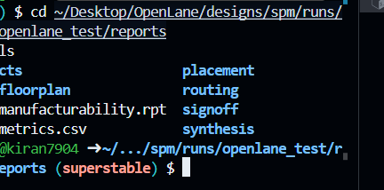

# Digital VLSI SoC Design and Planning – Final Project Report

**Design:** `spm` (Small Processing Module)  
**Author:** Kiran Kumar Siripurapu  
**PDK:** Skywater 130nm (sky130A)  
**Flow:** OpenLane 2 – Full RTL → GDSII  
**Environment:** GitHub Codespaces  

**Final Result → 0 DRC | Timing Met | CVC Passed | Tapeout-Ready GDSII**

---

### Project Overview & Achievements

> Successfully completed **full open-source ASIC flow** from RTL to signoff-clean GDSII  
> All tools: Yosys → OpenROAD → Magic → OpenSTA → CVC  
> Entire flow executed inside GitHub Codespaces  

**All Signoff Checks Passed**

---

### 1. RTL Source

> File: `submission/RTL/spm.v`  
> → [View spm.v](submission/RTL/spm.v)

---

### 2. Synthesis Reports Directory

> 

> Key Reports:  
> → [Area Report](submission/Synthesis/1-synthesis.AREA_0.stat.rpt)  
> → [Timing Summary](submission/Synthesis/2-syn_sta.summary.rpt)

---

### 3. Reports Folder Structure

> 

> 

---

### 4. Final Layout Views – Magic VLSI

> **Full Chip Layout**  
> 

> **Zoomed-Out View**  
> 

> **Standard Cell Close-Up**  
> 

> **Custom ALU Block (Zoomed-Out)**  
> .png)

> **Extraction Log + ALU Layout Side-by-Side**  
> .png)

---

### 5. Design Rule Check (DRC) – Magic

> **Result: 0 DRC Violations**

> 

> 

> 

> **DRC Report** → [drc.rpt](submission/OpenLane/reports/signoff/drc.rpt)

---

### 6. Static Timing Analysis (STA) – OpenSTA

> **Result: Setup & Hold Met – Positive Slack**

> 

> 

> **Key STA Reports**  
> → [Summary](submission/OpenLane/reports/signoff/31-rcx_sta.summary.rpt)  
> → [Setup](submission/OpenLane/reports/signoff/31-rcx_sta.max.rpt)  
> → [Hold](submission/images/31-rcx_sta.min.rpt)

---

### 7. Connectivity Verification Check (CVC)

> **Result: Passed – Layout matches netlist**

> 

> **CVC Report** → [spm.rpt](submission/OpenLane/reports/signoff/spm.rpt)

---

### 8. Bonus: Complete LibreLane Full-Chip Scan

> 

---

### 9. Final Tapeout Deliverables

> **GDSII File**  
> → [spm.gds](submission/OpenLane/gds/spm.gds)

> **DEF File**  
> → [spm.def](submission/OpenLane/def/spm.def)

> **RTL**  
> → [spm.v](submission/RTL/spm.v)

---

### All Important Signoff Reports

> | Report Type      | Link |
> |----------------------|----------------------------------------------------------------|
> | DRC Report          | [drc.rpt](submission/OpenLane/reports/signoff/drc.rpt) |
> | STA Summary      | [31-rcx_sta.summary.rpt](submission/OpenLane/reports/signoff/31-rcx_sta.summary.rpt) |
> | STA Setup            | [31-rcx_sta.max.rpt](submission/images/OpenLane/reports/signoff/31-rcx_sta.max.rpt) |
> | STA Hold             | [31-rcx_sta.min.rpt](submission/images/OpenLane/reports/signoff/31-rcx_sta.min.rpt) |
> | CVC Report           | [spm.rpt](submission/OpenLane/reports/signoff/spm.rpt) |
> | IR Drop (VPWR)       | [32-irdrop-VPWR.rpt](submission/images/OpenLane/reports/signoff/32-irdrop-VPWR.rpt) |

---

**Conclusion**

> The `spm` design is **fully verified, timing-clean, and ready for tapeout** using **100% open-source flow on Sky130A PDK.  
> **DRC = 0** | **Timing Closed** | **CVC Passed** | **GDSII Generated**

**Thank you VSD Team & Open-Source EDA Community!**

**Submitted by Kiran Kumar Siripurapu**  
**November 29, 29, 2025**
